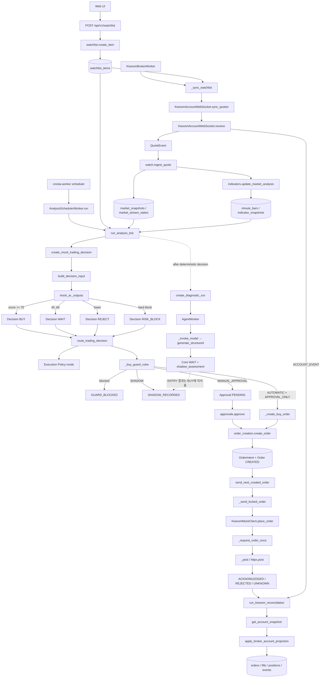

# Cresta v2 Phase 0 — Existing Architecture Analysis

## 문서 상태

- Status: Historical Analysis Snapshot
- Authority: Non-normative
- Analysis Date: 2026-08-23
- Code Modification: None

이 문서는 Cresta v2 리팩터링 시작 시점의 기존 구현을
정적 분석하여 기록한 스냅샷이다.

이 문서는 제품 요구사항이나 목표 아키텍처를 정의하지 않는다.

현재 목표 설계의 기준은 다음 문서이다.

- `docs/SYSTEM_DESIGN.md`
- `docs/AI_DECISION_SPEC.md`
- `docs/MULTI_AGENT_ORCHESTRATION_SPEC.md`
- `docs/DECISION_EXECUTION_SPEC.md`

현재 구현 상태의 기준은 `IMPLEMENTATION_STATUS.md`이다.

정적 코드 분석만 수행했습니다. 코드 수정·파일 생성·리팩터링·테스트 실행은 하지 않았습니다.

가장 중요한 결론은 다음과 같습니다.

- 현재 신규 `BUY`는 LLM이 아니라 `deterministic-mock-v2`의 점수 규칙에서 결정됩니다.
- 외부 LLM Agent의 ENTRY 결과는 실제 `BUY`에 사용되지 않습니다.
- 현재 `APPROVAL_ONLY + AUTOMATIC`이면 승인 없이 자동 주문이 생성됩니다.
- `buy_execution_ready`는 계산되지 않고 API 응답에서 항상 `false`입니다.
- `SHADOW`는 Decision 라우팅 시 신규 주문 생성을 막지만, 이미 존재하는 `CREATED` 주문이나 진단용 Mock 주문까지 전역적으로 막지는 않습니다.

## 단계별 실행 흐름

| 단계 | 코드 및 호출 흐름 | DB entity/table | 상태·enum | 주요 설정 |
|---|---|---|---|---|
| 1. Watchlist 등록 | [`post_watchlist()`](C:/Users/Jae/Documents/Cresta/backend/app/api/watchlist.py:94) → [`create_item()`](C:/Users/Jae/Documents/Cresta/backend/app/watchlist.py:42). 호출 대상은 사용자 잠금, 중복/최대 3개 검증, 감사 로그 저장입니다. 클래스는 `WatchlistItem`, `AuditLog`입니다. | `watchlist_items`, `users`, `audit_logs` | market=`KRX`만 허용. UI data status=`WAITING_FOR_DATA / AVAILABLE / STALE / DEGRADED` | `MAX_WATCHLIST_ITEMS=3`, `CRESTA_QUOTE_STALE_SECONDS` |
| 2. Scheduler 실행 | `cresta-worker scheduler` → [`_run_worker()`](C:/Users/Jae/Documents/Cresta/backend/app/worker.py:428) → `AnalysisSchedulerWorker.run()` → `analysis_slot()` → [`run_analysis_tick()`](C:/Users/Jae/Documents/Cresta/backend/app/analysis_scheduler.py:162). `08:00~11:00` 5분, `11:00~20:00` 10분 슬롯입니다. | `analysis_scheduler_leases`, `analysis_scheduler_states`, `watchlist_items`, `users`, `positions`, `market_stream_states` | Scheduler=`STARTING / RUNNING / IDLE / DEGRADED / STOPPED` | `CRESTA_ANALYSIS_SCHEDULER_POLL_SECONDS`, `CRESTA_ANALYSIS_SCHEDULER_LEASE_SECONDS` |
| 3. 시장 데이터 수집 | `KiwoomBrokerWorker._sync_watchlist()` → `active_kiwoom_symbols()` → `KiwoomAccountWebSocket.sync_quotes()`. `KiwoomAccountWebSocket.receive()` → `_parse_quote_item()` → `QuoteEvent` → `KiwoomBrokerWorker._persist_quote()` → [`ingest_quote()`](C:/Users/Jae/Documents/Cresta/backend/app/watch.py:139) → [`update_market_analysis()`](C:/Users/Jae/Documents/Cresta/backend/app/indicators.py:23). | `market_snapshots`, `market_stream_states`, `minute_bars`, `indicator_snapshots` | snapshot quality=`NORMAL / LATE / GAP_DETECTED`; stream=`NORMAL / GAP_DETECTED`; trading status=`PRE_MARKET / TRADING / VI / HALTED / CLOSING_AUCTION / CLOSED / NO_QUOTES` | `CRESTA_KIWOOM_*`, `CRESTA_KIWOOM_WATCHLIST_SYNC_SECONDS`, `CRESTA_QUOTE_STALE_SECONDS` |
| 4. 종목 평가 | `run_analysis_tick()` → `create_mock_trading_decision()` → [`create_mock_decision()`](C:/Users/Jae/Documents/Cresta/backend/app/mock_ai.py:369) → [`build_decision_input()`](C:/Users/Jae/Documents/Cresta/backend/app/decision_inputs.py:38) → `_outputs()`. 보유 종목은 `create_mock_position_trading_decision()` → `_position_outputs()`입니다. | `decision_input_snapshots`, `decisions`, `market_snapshots`, `market_stream_states`, `indicator_snapshots`, `positions` | purpose=`TRADING`; kind=`ENTRY / POSITION`; validation=`VALID` | `CRESTA_QUOTE_STALE_SECONDS`; 코드 상 `score_policy_version=mock-score-v2` |
| 5. BUY/WAIT 판단 | ENTRY의 실제 분기는 [`_outputs()`](C:/Users/Jae/Documents/Cresta/backend/app/mock_ai.py:33)입니다. hard block이면 `RISK_BLOCK`, `score>=70`이면 `BUY`, `45~69`이면 `WAIT`, 그 미만은 `REJECT`입니다. | `decisions` | `BUY / WAIT / REJECT / RISK_BLOCK`; POSITION은 `HOLD / PARTIAL_SELL / FULL_SELL` | `MODEL_ID=deterministic-mock-v2`, `PROMPT_VERSION=mock-entry-indicators-v2` |
| 6. Guard | Scheduler가 Decision 생성 직후 [`route_trading_decision()`](C:/Users/Jae/Documents/Cresta/backend/app/decision_execution.py:352)을 호출합니다. BUY는 `_buy_guard_rules()`, 매도는 `_sell_guard_rules()`입니다. 승인 시에는 `approvals._evaluate_approval()`이 Guard를 다시 실행합니다. | `decision_executions`, `guard_evaluations`, `configuration_versions`, `trading_gates`, `emergency_stops`, `risk_events`, `orders`, `positions` | Guard=`PASSED / BLOCKED`; execution mode=`AUTOMATIC / MANUAL_APPROVAL / DISABLED`; stage=`SHADOW / APPROVAL_ONLY / MOCK_AUTOMATIC` | `CRESTA_ENVIRONMENT`, `CRESTA_EXECUTION_STAGE`, 활성 `EXECUTION_POLICY`, 활성 Risk Policy |
| 7. Order 생성 | 자동 BUY: `route_trading_decision()` → [`_create_buy_order()`](C:/Users/Jae/Documents/Cresta/backend/app/decision_execution.py:556) → [`create_order()`](C:/Users/Jae/Documents/Cresta/backend/app/order_creation.py:120). 수동 승인: `create_approval()` → API `approve_approval()` → `approvals.approve()` → 같은 `create_order()`. | `approvals`, `order_intents`, `orders`, `order_events`, `audit_logs` | Approval=`PENDING / APPROVED / REJECTED / EXPIRED / INVALIDATED`; 신규 주문=`CREATED`; BUY 미체결 정책=`CANCEL`, 10초 | Risk Policy `entry_order_amount`, `max_price_deviation_pct`; execution policy `buy` |
| 8. Worker | `cresta-worker kiwoom` → `KiwoomBrokerWorker.run()` → `_receive_loop()` → [`_dispatch_next_order()`](C:/Users/Jae/Documents/Cresta/backend/app/worker.py:284) → [`send_next_created_order()`](C:/Users/Jae/Documents/Cresta/backend/app/broker/order_sender.py:168). FIFO로 한 건씩 처리합니다. | `broker_leases`, `broker_worker_states`, `trading_gates`, `orders`, `order_events` | Worker=`STARTING / AUTHENTICATING / CONNECTING / SUBSCRIBING / RECONCILING / READY / DEGRADED / STOPPED`; Order=`CREATED→VALIDATING→SUBMITTING` | `CRESTA_KIWOOM_WORKER_LEASE_SECONDS`, `HEARTBEAT_SECONDS`, `RECONCILE_INTERVAL_SECONDS`, `EVENT_DEBOUNCE_SECONDS` |
| 9. Kiwoom Broker | `order_sender._send_locked_order()` → `client.place_order()` → [`KiwoomMockClient.place_order()`](C:/Users/Jae/Documents/Cresta/backend/app/broker/kiwoom.py:415) → `_request_order_once()` → [`_post()`](C:/Users/Jae/Documents/Cresta/backend/app/broker/kiwoom.py:548) → `httpx.Client.post()`. BUY/SELL API ID를 여기서 선택합니다. | 성공/실패 결과가 `orders`, `order_events`, `trading_gates`에 반영 | 성공=`ACKNOWLEDGED`; 명시 거절=`REJECTED`; 결과 불명=`UNKNOWN`; 전송 전=`SUBMITTING` | `CRESTA_KIWOOM_REST_BASE_URL`, `TIMEOUT_SECONDS`, key/secret/account secret file |
| 10. 상태/체결 반영 | ACK는 `order_sender._finish_send()`. 실제 체결은 WebSocket 계좌 이벤트가 직접 fill을 쓰지 않고 reconciliation을 유발합니다. `KiwoomBrokerWorker._reconcile()` → [`run_kiwoom_reconciliation()`](C:/Users/Jae/Documents/Cresta/backend/app/reconciliation.py:77) → `KiwoomMockClient.get_account_snapshot()` → [`apply_broker_account_projection()`](C:/Users/Jae/Documents/Cresta/backend/app/account_projection.py:37). | `reconciliation_runs`, `reconciliation_mismatches`, `orders`, `order_events`, `fills`, `positions`, `position_events`, `trading_gates` | Order=`ACKNOWLEDGED / OPEN / PARTIALLY_FILLED / FILLED / CANCEL_PENDING / CANCELLED / UNKNOWN / RECONCILING`; Position=`OPEN / CLOSED`; Gate=`READY / RECONCILING / DEGRADED / HALTED` | reconcile interval/debounce, account alias=`KIWOOM_MOCK_PRIMARY`, environment=`MOCK` |

## 필수 질문 답변

### 1. 현재 BUY는 정확히 어디에서 결정되는가?

[`backend/app/mock_ai.py::_outputs()`](C:/Users/Jae/Documents/Cresta/backend/app/mock_ai.py:33)에서 결정됩니다.

핵심 분기는 다음과 같습니다.

- spread `> 0.5%` 또는 변동성 `EXTREME`: `RISK_BLOCK`
- 점수 `>= 70`: `BUY`
- 점수 `>= 45`: `WAIT`
- 그 외: `REJECT`

점수 입력은 VWAP 대비 가격, SMA5 기울기, 상대 거래량, 변동성, 고점 대비 낙폭, spread입니다. 결과는 `Decision.action`에 저장됩니다.

### 2. deterministic-mock-v2는 어디에서 선택되는가?

동적 선택이 아닙니다.

[`mock_ai.py`](C:/Users/Jae/Documents/Cresta/backend/app/mock_ai.py:15)에 `MODEL_ID = "deterministic-mock-v2"`로 하드코딩되어 있고, Scheduler가 `create_mock_trading_decision()`을 직접 호출합니다. `evaluation_request_id()`에도 이 상수가 포함됩니다.

즉 Provider registry, 활성 LLM route 또는 설정이 진입 모델을 선택하지 않습니다.

### 3. LLM Agent는 어떤 코드에서 호출되는가?

호출 흐름은 다음입니다.

`AgentWorker.run()`
→ `process_agent_work_once()`
→ `execute_claimed_stage()`
→ `_execute_stage()`
→ [`_invoke_model()`](C:/Users/Jae/Documents/Cresta/backend/app/agents/runtime.py:637)
→ [`_invoke_once()`](C:/Users/Jae/Documents/Cresta/backend/app/agents/runtime.py:368)
→ `provider_registry.resolve(...).generate_structured(...)`

실제 외부 Adapter는 `OPENAI_RESPONSES`, `ANTHROPIC_MESSAGES`, `GEMINI_GENERATE_CONTENT`, `OPENAI_COMPATIBLE` 중 활성 route의 provider에 따라 선택됩니다.

### 4. LLM Agent 결과가 실제 BUY 판단에 사용되는가?

아니요.

- Scheduler는 결정론적 Decision을 먼저 만들고 즉시 `route_trading_decision()`으로 넘깁니다.
- 그 이후 별도로 ENTRY `DIAGNOSTIC` Agent run을 생성합니다.
- Agent Core의 `core_action`은 [`_finalize_run()`](C:/Users/Jae/Documents/Cresta/backend/app/agents/worker.py:94)에서 `WAIT`로 고정됩니다.
- ENTRY Agent 결과는 `Decision`, `Approval`, `OrderIntent`, `TradingOrder`로 복사되지 않습니다.

단, 보유 포지션의 LLM `TRADING_ADVISORY`는 [`finalize_position_advisory()`](C:/Users/Jae/Documents/Cresta/backend/app/position_agent_fusion.py:100)을 통해 위험을 상향하여 `PARTIAL_SELL/FULL_SELL` Decision을 만들 수 있습니다. 이는 BUY가 아니라 매도 위험 상향 경로입니다.

### 5. AUTOMATIC은 어디에서 판단되는가?

[`route_trading_decision()`](C:/Users/Jae/Documents/Cresta/backend/app/decision_execution.py:352)에서 판단됩니다.

- `active_policy()`로 활성 `ConfigurationVersion`을 조회
- `policy_payload()`로 Execution Policy 역직렬화
- `_mode_for(action, policy)`로 `BUY → policy.buy` 매핑
- Guard 통과 후 `mode == "AUTOMATIC"`이면 `_create_buy_order()` 직접 호출

기본 BUY 정책은 [`SAFE_DEFAULT_POLICY.buy="MANUAL_APPROVAL"`](C:/Users/Jae/Documents/Cresta/backend/app/execution_policy.py:16)이지만 사용자가 `AUTOMATIC`으로 활성화할 수 있습니다.

### 6. SHADOW_ONLY가 실제 주문을 막는 위치는 어디인가?

Decision 경로에서는 [`route_trading_decision()` 478~519행](C:/Users/Jae/Documents/Cresta/backend/app/decision_execution.py:478)입니다.

`settings.execution_stage`가 `ORDER_ENABLED_STAGES={"APPROVAL_ONLY","MOCK_AUTOMATIC"}`에 없으면:

- `execution.state="SHADOW_RECORDED"`
- `result_code="SHADOW_ONLY"`
- Approval과 Order를 만들지 않습니다.

하지만 전역 주문 차단기는 아닙니다.

- Broker worker는 `CREATED` 주문을 보낼 때 `execution_stage`를 검사하지 않습니다.
- 기존 `PENDING` Approval 승인 함수도 현재 `execution_stage`를 재검사하지 않습니다.
- `/system/broker/mock-order-test`는 SHADOW 여부와 무관하게 직접 `CREATED` BUY를 만들 수 있습니다.

### 7. APPROVAL_ONLY인데 자동 주문이 가능한 경로가 있는가?

있습니다. 명시적으로 구현되어 있고 테스트까지 있습니다.

`APPROVAL_ONLY`는 `ORDER_ENABLED_STAGES`에 포함됩니다. 따라서:

```text
execution_stage=APPROVAL_ONLY
+ policy.buy=AUTOMATIC
+ BUY Guard PASSED
→ _create_buy_order()
→ create_order()
→ orders.status=CREATED
→ 승인 없음
```

근거 테스트는 [`test_buy_automatic_in_approval_only_creates_order_directly()`](C:/Users/Jae/Documents/Cresta/backend/tests/test_approvals_api.py:442)입니다.

이는 “APPROVAL_ONLY에서는 MANUAL_APPROVAL만 허용”이라는 명세와 직접 충돌합니다.

### 8. buy_execution_ready는 어디에서 결정되는가?

결정되지 않습니다.

[`system_health()` 응답](C:/Users/Jae/Documents/Cresta/backend/app/api/system.py:119)에서 다음 값이 하드코딩되어 있습니다.

- `decision_execution_status="SHADOW_ONLY"`
- `buy_execution_ready=False`
- block reason은 비상정지가 아니면 항상 `ORDER_SIZE_NOT_CONFIGURED`

실제 주문 가능성은 Execution Policy, `execution_stage`, Risk Policy, Guard, Broker READY 등에 의해 별도로 결정되므로 이 API 필드는 실제 상태와 불일치할 수 있습니다.

### 9. Order 생성 함수는 무엇인가?

공용 생성 함수는 [`app.order_creation.create_order()`](C:/Users/Jae/Documents/Cresta/backend/app/order_creation.py:120)입니다.

이 함수가 원자적으로 생성하는 것은:

- `OrderIntent`
- `TradingOrder(status="CREATED")`
- `OrderEvent(event_type="ORDER_CREATED")`
- `AuditLog`

호출자는 자동 BUY/SELL, Approval 승인, fixed-stop 경로입니다.

별도로 진단용 `/broker/mock-order-test`는 공용 함수를 사용하지 않고 `create_mock_order_test()`에서 `OrderIntent`와 `TradingOrder`를 직접 생성합니다.

### 10. Kiwoom API를 실제 호출하는 최종 함수는 무엇인가?

주문 의미상 최종 Adapter 함수는 `KiwoomMockClient.place_order()`입니다.

실제 네트워크 호출까지 포함하면:

```text
place_order()
→ _request_order_once()
→ _post()
→ self._http.post(...)
```

따라서 실제 HTTP 요청을 발생시키는 최종 함수는 [`KiwoomMockClient._post()`](C:/Users/Jae/Documents/Cresta/backend/app/broker/kiwoom.py:548)입니다.

## 현재 Call Graph



## CURRENT_ARCHITECTURE

- 단일 FastAPI API와 세 장기 프로세스가 있습니다: Kiwoom worker, analysis scheduler, agent worker.
- 시장 데이터 수집과 주문 전송은 같은 `KiwoomBrokerWorker` 프로세스에 결합되어 있습니다.
- 실제 진입 판단은 `deterministic-mock-v2`가 소유합니다.
- 외부 LLM Agent는 별도 SHADOW DAG이며 ENTRY BUY와 분리되어 있습니다.
- Decision 실행은 `route_trading_decision()`이 Execution Policy, Guard, Approval/Automatic 분기를 한꺼번에 담당합니다.
- Order 생성과 Broker 전송은 분리되어 있습니다. `create_order()`는 `CREATED`까지만 만들고 worker가 전송합니다.
- 주문/체결의 최종 원장은 WebSocket 이벤트 자체가 아니라 REST 계좌 재동기화 결과입니다.

## ARCHITECTURAL_CONFLICTS

- `APPROVAL_ONLY`의 구현 의미가 명세와 반대입니다. 현재는 `AUTOMATIC` 주문도 허용합니다.
- `Settings.validate_safety()`는 `MOCK_AUTOMATIC`을 금지하지만 실행 라우터는 이를 지원 대상으로 선언합니다. 결과적으로 자동 주문 기능이 잘못된 `APPROVAL_ONLY` 단계에 들어가 있습니다.
- `buy_execution_ready=false`와 실제 주문 가능 경로가 서로 독립적입니다.
- `decision_execution_status="SHADOW_ONLY"`도 실제 `CRESTA_EXECUTION_STAGE`와 무관하게 하드코딩되어 있습니다.
- ENTRY Agent와 결정론적 BUY 엔진이 동일한 “AI 판단” 개념 아래 병렬 존재하지만 결과 결합 계약이 없습니다.
- Guard 로직이 `decision_execution`, `approvals`, `guard.py`, stop-trigger 경로에 분산되어 있습니다.
- Venue selection은 SHADOW-only 평가 모델이지만 실제 주문 생성은 Decision의 `market`을 그대로 사용합니다.
- `Decision.execution_mode`와 `execution_outcome`은 생성 시 `None/NO_ACTION`으로 남고, 실제 상태는 별도 `DecisionExecution`에 존재합니다.
- 시장 데이터 수집, 주문 dispatch, stop trigger, reconciliation이 하나의 worker loop에 결합되어 있습니다.

## DANGEROUS_EXECUTION_PATHS

1. `APPROVAL_ONLY + AUTOMATIC BUY`가 승인 없이 주문을 생성합니다.
2. SHADOW로 전환해도 이미 생성된 `CREATED` 주문은 worker가 계속 전송할 수 있습니다. Worker에는 execution-stage 재검사가 없습니다.
3. `APPROVAL_ONLY`에서 생성된 `PENDING` Approval이 남아 있는 상태에서 SHADOW로 변경해도 `approvals.approve()`는 현재 stage를 재검사하지 않습니다.
4. `/api/v1/system/broker/mock-order-test`는 Execution Policy와 SHADOW gate를 우회하여 1주 BUY를 직접 생성합니다.
5. fixed-stop은 기본 정책이 `AUTOMATIC`이고 `APPROVAL_ONLY`에서도 자동 SELL이 허용됩니다.
6. 시스템 health가 `buy_execution_ready=false`를 표시해도 실제 자동 BUY 경로는 열릴 수 있습니다.
7. Worker는 주문의 생성 출처나 `DecisionExecution.stage`를 확인하지 않고 모든 적격 `CREATED` MOCK 주문을 FIFO 전송합니다.

## REUSABLE_COMPONENTS

- 불변 `MarketSnapshot`과 source-event 멱등 수집 구조
- Minute bar 및 지표 계산기
- `DecisionInputSnapshot`의 canonical JSON/hash 구조
- `create_order()`의 멱등키와 수량 불변조건
- Broker lease/fencing 및 READY gate
- 결과 불명 시 즉시 reconciliation으로 전환하는 주문 sender
- 계좌 snapshot 기반 `orders/fills/positions` 투영
- LLM Provider Adapter/route/structured-output 검증 계층
- Agent stage claim/lease/fail-closed 처리
- 포지션 LLM 결과가 위험을 낮추지 못하도록 하는 비대칭 fusion 정책

## COMPONENTS_TO_REFACTOR

- 진입 판단 인터페이스: `deterministic-mock-v2`와 Agent 결과의 책임을 명확히 분리
- 실행 단계 gate: `SHADOW / APPROVAL_ONLY / MOCK_AUTOMATIC`의 의미를 단일 정책 객체로 통합
- 주문 직전 전역 실행 허가 검사: stage, readiness, provenance를 worker에서도 재검증
- `buy_execution_ready` 계산 서비스와 health 응답
- BUY/SELL/Approval/Stop Trigger의 Guard 통합
- `Decision → DecisionExecution → Approval → OrderIntent` 상태와 책임 정리
- 직접 주문을 만드는 `create_mock_order_test()`를 공용 주문 생성 경계와 분리하거나 명확한 진단 전용 gate로 제한
- 문자열 기반 상태와 enum을 중앙화
- 시장 데이터 worker와 주문/reconciliation worker 책임 분리
- 실제 주문 경로에 Venue Selection을 연결하거나 현재 SHADOW 평가를 명확히 제거
- LLM ENTRY 결과가 영원히 진단용인지, 향후 후보 신호인지 명확한 승격 계약 정의

분석 과정에서 저장소 파일은 변경하지 않았습니다.